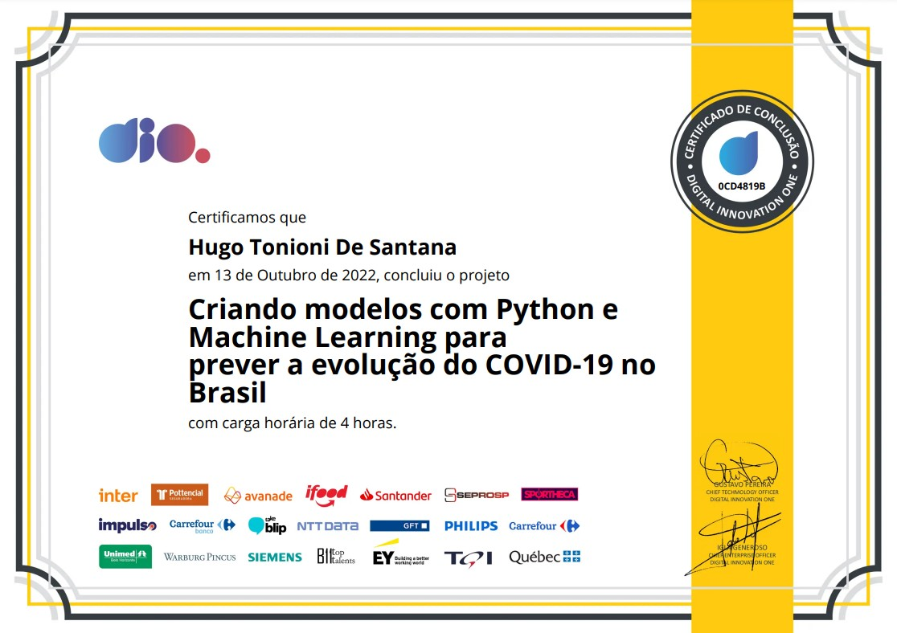

# Analise dos dados do Covid-19 e previsão de séries temporais com ARIMA e Prophet

Projeto da DIO Labs _Criando modelos com Python e Machine Learning para prever a evolução do COVID-19 no Brasil_. Neste projeto, tive o primeiro contato com o conceito de Séries Temporais, e a previsão destas usando o modelo [pmdARIMA](https://pypi.org/project/pmdarima/) e o [Prophet](https://facebook.github.io/prophet/docs/quick_start.html).

Neste projeto é feito uma análise exploratória dos dados do COVID-19 no Brasil, no período inicial da pandemia (2019-2020), utilizando as bibliotecas [Pandas](https://pandas.pydata.org/).

Além disso, são feitas previsões sobre as séries temporais dos números de _casos confirmados_ e _novos casos por dia_ utilizado as bibliotecas [pmdARIMA](https://pypi.org/project/pmdarima/) e [Prophet](https://facebook.github.io/prophet/docs/quick_start.html).

---

Curso ministrado por [Neylson Crepalde](https://github.com/neylsoncrepalde).
Promovido por [Digital Innovation One.](https://www.dio.me/)

## Certificado

